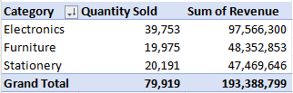
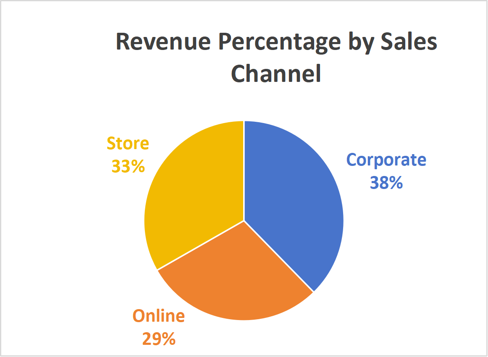
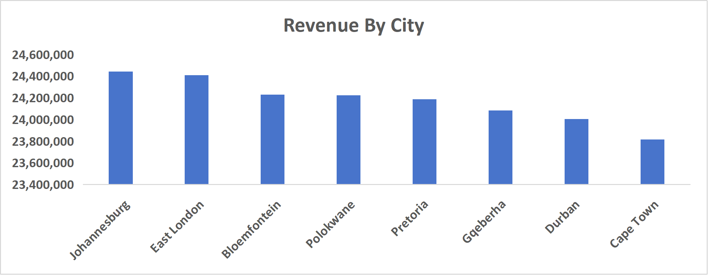
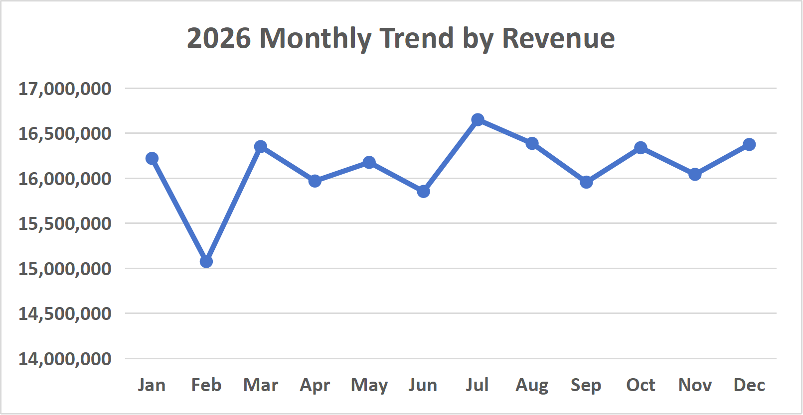

# Retail Sales and Business Performance Analysis
**SQL | Excel | Data Analysis | Business Reporting**

## Executive Summary

This project analyses retail sales data to understand what drives revenue and profitability, how products and customer segments perform, and where the business could improve its sales strategy and reduce avoidable costs.

The dataset contains **10,000 orders, 1,000 customers, 100 products and 1,006 recorded returns**. I used SQL Server to analyse the data and Excel to connect related tables using XLOOKUP, create pivot tables and charts, and build an interactive dashboard.

The analysis highlights Electronics as the leading revenue-generating category, Corporate as the strongest revenue-generating sales channel, and a **10.06% return rate** that warrants further investigation.

## Business Problem

The business needs to understand which products, customers, locations and sales channels contribute most to its performance. It also needs to assess whether discounts are supporting profitable growth and whether product returns are creating avoidable costs.

The objective was to turn sales data into actionable insights that can help management **protect revenue, improve profitability, allocate inventory more effectively and make better-informed business decisions**.

## Business Questions

- How much revenue and profit does the business generate, and how do discounts affect revenue?
- Which product categories generate the most revenue compared with the quantities sold?
- Which customer segments and sales channels contribute most to revenue?
- Which cities and provinces perform best?
- How does revenue change throughout the year?
- What does the return rate suggest about potential opportunities to reduce costs?

## Methodology

### SQL Analysis
I used SQL Server to analyse the retail data, bringing together information from orders, customers, products and returns to evaluate revenue, profitability, product performance, geographical trends, and returns.

### Excel Analysis and Dashboard
I used **XLOOKUP** to connect relevant information from related tables into the main Orders table, supporting consistent calculations and visualisation.

I then used pivot tables, pivot charts, and an interactive dashboard to present the key business metrics and make performance patterns easier to interpret.

### Business Reporting
I translated the results into business implications and recommendations, focusing on revenue growth, profitability, inventory decisions and return-related risks.

## Key Findings and Business Actions

### Revenue and Profitability

```sql
-- Total Revenue
SELECT 
    SUM(p.UnitPrice * o.Quantity) AS [Total Revenue] 
FROM Products AS P 
JOIN Orders AS O 
    ON p.productid = o.productid; 

-- Revenue after Discount
SELECT
    SUM(
        p.UnitPrice * o.Quantity * (1 - o.Discount)
    ) AS [Discounted Revenue]
FROM Products AS p
JOIN Orders AS o
    ON p.ProductID = o.ProductID;

-- Profit after discount
SELECT
    SUM(
        (p.UnitPrice * o.Quantity * (1 - o.Discount))
        -
        (p.CostPrice * o.Quantity)
    ) AS [Total Profit]
FROM Products AS p
JOIN Orders AS o
    ON p.ProductID = o.ProductID;
```

The business generated over **R190 million in revenue**, approximately **R172 million in discounted revenue**, and **R56 million in total profit**.

**Business action:** Management should evaluate discount performance to determine whether the additional sales justify the reduction in revenue and potential pressure on profit margins.

### Product Performance



Electronics generated almost **R100 million in revenue**, making it the strongest-performing category. Furniture ranked second at approximately **R48 million**, despite recording fewer than 20,000 units sold. Stationery sold more than 20,000 units but generated substantially less revenue than Furniture.

**Business action:** Maintain reliable stock availability for high-revenue Electronics products. Assess product-level margins and demand before making inventory decisions, and avoid treating high sales volumes as a guarantee of high financial contribution.

### Customer and Sales Channel Performance



The Corporate sales channel generated approximately **R72.9 million**, accounting for around **38% of total revenue**.

**Business action:** Protect and develop the Corporate channel through strong customer relationships and reliable fulfilment. Further analysis of customer-level purchasing patterns could help identify opportunities to grow revenue from other segments.

### Geographical and Monthly Performance



The Eastern Cape generated over **R14 million in combined provincial revenue**, while Johannesburg was the highest-revenue individual city, generating over R2 million. Revenue peaked in **July at more than R16.5 million**, while February recorded the lowest monthly revenue.



**Business action:** Investigate what drives the Eastern Cape's performance and use the findings to inform regional sales strategies. Review monthly fluctuations to determine whether seasonality, product availability or changes in demand explain the differences.

### Product Returns

```sql
-- RETURNS RATE
SELECT
(
    COUNT(DISTINCT OrderID) * 1.0 
    /
    (SELECT COUNT(*) FROM Orders) 
) * 100 AS ReturnRate
FROM Returns;
```

The overall order return rate was **10.06%**, meaning approximately 10 out of every 100 orders resulted in a return record.

**Business action:** Analyse returns by product, category and sales channel to identify where returns are concentrated. Understanding the causes could help reduce avoidable returns, associated costs and potential losses in profitability.

## Overall Business Priorities

1. **Protect profitability:** Review discount effectiveness and understand their impact on revenue and profit.
2. **Prioritise inventory:** Maintain availability of high-revenue products while considering demand and profitability.
3. **Strengthen sales performance:** Protect the Corporate channel and investigate opportunities across other customer segments and regions.
4. **Improve operational planning:** Investigate monthly revenue fluctuations to support better sales and inventory planning.
5. **Reduce avoidable returns:** Identify the products and channels contributing most to returns and investigate their causes.

## Limitations

The analysis uses a simulated retail dataset and reflects the information available in the project. It identifies performance patterns but does not establish what caused them.

Further investigation is required to confirm the reasons behind returns, regional differences and monthly fluctuations. The findings should therefore guide follow-up analysis rather than be treated as proof of causation.

## Next Steps

Further analysis could investigate:

- Profit margins by product, category and sales channel.
- The relationship between discounts, sales volume and profitability.
- Return rates and reasons by product, category and channel.
- Customer purchasing behaviour and repeat purchases.
- Regional performance relative to customer numbers and order volumes.
- Monthly demand patterns to improve inventory planning.

## Project Deliverables

- **SQL Analysis** — retail sales, revenue, profitability, customer and product performance.
- **Excel Dashboard** — interactive visualisation of key business metrics.
- **Business Report** — findings, implications and recommendations.
- **Supporting Data** — related retail tables used in the analysis.

## Dashboard Preview


## Final Takeaway

The analysis shows that **revenue growth needs to be supported by sound profitability, effective inventory decisions and better control of returns**. Electronics and the Corporate sales channel are important revenue drivers, while the return rate and monthly fluctuations highlight areas that deserve closer attention.

This project demonstrates how I used SQL and Excel together to analyse retail performance and turn transactional data into practical, business-focused recommendations.
